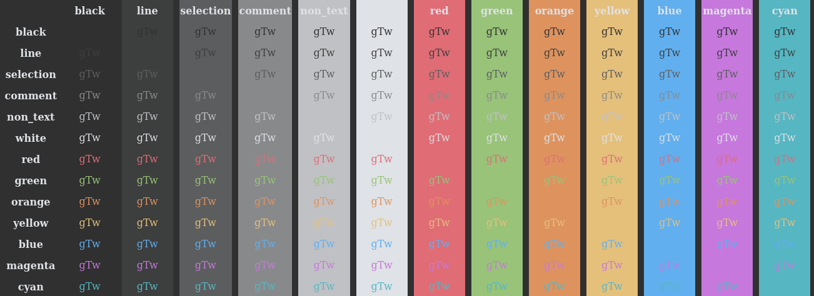

# Bright Bit theme.
In this you can see both the colors module and the neovim plugin being used.


Highly based on the [onehalf](https://github.com/sonph/onehalf) theme, but with custom configs.

I have used the colors from one half dark but with custom themes for application for some applications,
like neovim for example



the colorscheme:
```
00  normal  black       #282c34
01  normal  non_text    #919baa
02  normal  selection   #474e5d
03  normal  comments    #5c6370
04  normal  line        #313640
05  normal  white       #dcdfe4
06  normal  red         #e06c75
07  normal  green       #98c379
08  normal  orange      #de935f
09  normal  yellow      #e5c07b
10  normal  blue        #61afef
11  normal  magenta     #c678dd
12  normal  cyan        #56b6c2
```


This theme is made with [nix enviroment](https://nixos.org/) in mind,
as such you can use the [flake](./flake.nix) in your system config.

## Themed applications:

- [Neovim](./neovim/)
- [Firefox](./firefox/)
- [Sddm](./sddm/)
- [Dunst[(./dunst)

## How to use:
### Non nix version
Checkout the readmes for each aplication/plugin (see list above).

### Nix version
Include the modules (nixosModule, homemanagerModule or a specific module) and
then enable as needed.


#### Nix Options
bright-bit
- colors
    - black
	- ...
	- white
- apps
    - system (needs nixosModule)
	    - enable
		- sddm
		    - enable
	- user (needs homemanagerModule)
        - enable
        - firefox
		    - enable
            - profile
        - nvim
		    - enable
        - dunst
            - enable
		- ~~lf~~
		- ~~alacrity~~
		- ~~rofi~~
		
Striketrough options are not implemented.

You can use as `bright-bit.apps.user.firefox.enable = true`.
