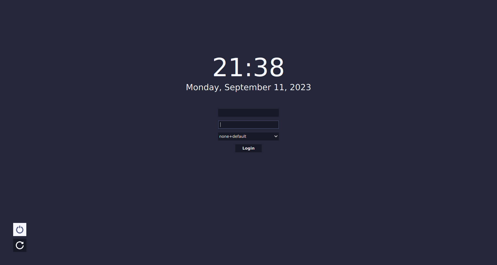

# bright bit SDDM Theme

A minimalist SDDM theme designed to provide a clean and simple login experience for your Linux desktop.



- Clean and minimalistic design.
- Easy-to-use and lightweight.
- Provides a distraction-free login environment.

## To Do

- [ ] Add click animation to buttons
- [ ] Make size of fields and buttons scale with font size
- [ ] Add statistics ( CPU Temp, RAM usage, Wifi, Battery)
- [ ] Fix Pixelated icons

## Installing

1. Clone the repo.
2. Put the [theme](./theme) folder in `/usr/share/sddm/teeny` for this you can use the command:
```bash
	mv ./theme /usr/share/sddm/teeny
```
3. Point SDDM to the theme, this is done by editing `/etc/sddm.conf.d/sddm.conf` (create if necessary). You can take the default config file of SDDM as reference `/etc/sddm.conf/usr/lib/sddm/sddm.conf.d/sddm.conf`.
4. In the `[Theme]` section simply add the themes name:`Current=teeny`


## Customizing the theme
Teeny is customizable by editing the theme.conf file.
It is possible to change:
- colors
- font
- Enable/Disable clock
- Enable/Disable statistics panel (not implemented)
- Enable/Disable custom background

## Taken inspiration from

- [pixarch](https://github.com/heisenburgh/pixarch)
- [catppuccin](https://github.com/catppuccin/sddm)
- [Icons are from here](https://www.flaticon.com)
